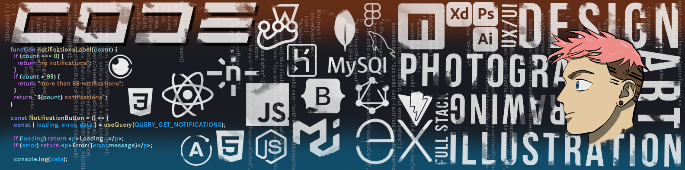

```js
import { SoftwareDeveloper, UX/UI Design } from 'mitch_morgan';

class Bio extends SoftwareDeveloper {
  this.name       = 'Mitchell Morgan';
  this.title      = 'Full-Stack Developer';
  this.location   = ['Loveland, CO', 'Chicago, IL'];
}

class Skills extends SoftwareDeveloper {
  this.languages     = ['JavaScript', 'HTML', 'CSS', 'SQL', 'C'git ];
  this.databases     = ['MongoDB', 'MySQL'];
  this.technologies  = ['React', 'GraphQL', 'Node.js', 'ExpressJS', 'jQuery', 'Bootstrap', 'Material-UI', 'CSS3', 'HTML5'];
  this.tools         = ['VSCode', 'Insomnia', 'Compass', 'Jest', 'Git' ]
}

class Skills extends UX/UI Design {
  this.tools         = ['Figma', 'Adobe XD', 'Adobe Photoshop', 'Adobe Illustrator']
  this.skills        = ['Wire Framing','User Research', 'Prototyping', 'User Testing']
}
```

🎸 I'm currently working on Blurb - a MERN stack application. [Check It Out!](https://github.com/ljkahn/Blurb)<br>📖 I'm currently learning Python, C++.<br>🧠 Ask me about working out, music, and my weird obsession with tacos. 🌮<br>📬 How to reach me mitchemorgan@gmail.com<br>✈️ Fun fact => I had the amazing opportunity to travel the world with an amazing orchestra!

## 🌐 Socials:

<a href = "https://www.linkedin.com/in/mitchell-morgan-0952b1138/" target="_blank"><a href = "https://lighthearted-babka-c9dccc.netlify.app/" target="_blank">

# 💻 Tech Stack:

                

# 📊 GitHub Stats:

<p align="center">

<br/>
<br/>


</p>

## 🏆 GitHub Trophies


---

[](https://visitcount.itsvg.in)

<!-- Proudly created with GPRM ( https://gprm.itsvg.in ) -->
